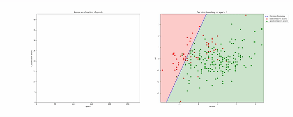

# ft_sommelier 
This project is a gateway to the machine learning in the 42 school. It will also help you become a master sommelier.

**Final mark:** 125/100 ✅

   
*ADALINE training animation*

## About the project
Project goal: Given the chemical attributes of a wine, classify it as "good" or "bad".

**Allowed libraries:** matplotlib, pandas, standard python lbraries.  
**Not allowed libraries:** numpy, scipy, scikit-learn, tensorflow, etc...

---

**Implemented models:**
* Perceptron
* ADALINE

> Also, as the bonus part, both these models implemented using Cython.

**Implemented validations:**
* Hold-out validation
* K-fold cross-validation

**Other ML stuff:**
* Feature scaling
* Scatterplot matrix

   
*Scatterplot matrix of the red wine dataset (showing first three features)*
